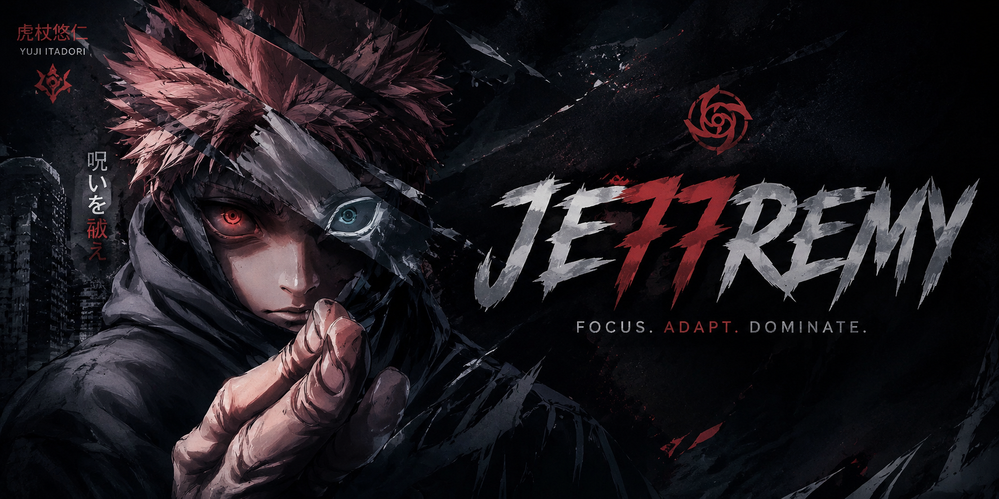

<div align="center">



<br/><br/>

[]()

<br/>

[](https://github.com/TU_CUENTA_PRINCIPAL)


</div>

---

# 🧪 JE7 Labs

Experimental branch dedicated to research, validation, prototyping, infrastructure testing and future project development.

This environment exists so production environments don't have to suffer the consequences of curiosity.

> **Research → Validation → Production**

<br/>

```yaml
environment : Laboratory
focus       : Research & Development
status      : Active
purpose     : Experiments & Validation
risk        : Controlled
production  : Restricted
```

---

# 🔬 Active Laboratories

<table>
<tr>
<td width="50%" valign="top">

### 🐳 Container Lab

- Docker
- Docker Compose
- Container Security
- Networking
- Isolation Strategies

</td>

<td width="50%" valign="top">

### ⚙️ Automation Lab

- GitHub Actions
- CI/CD Pipelines
- Release Automation
- Repository Templates
- Workflow Optimization

</td>
</tr>

<tr>
<td width="50%" valign="top">

### 🔒 Security Lab

- Vulnerability Research
- Hardening
- Authentication Models
- Secrets Management
- Access Control

</td>

<td width="50%" valign="top">

### 🌐 Infrastructure Lab

- Reverse Proxies
- Nginx
- TLS
- Observability
- System Architecture

</td>
</tr>
</table>

---

# ⚡ Current Research

```diff
@@ INFRASTRUCTURE @@

+ Reverse Proxy Architectures
+ Container Orchestration
+ Infrastructure Automation
+ Service Isolation
+ Monitoring Systems

@@ SECURITY @@

+ Security Auditing
+ Hardening Strategies
+ Attack Surface Reduction
+ Access Control Validation
+ Authentication Flows

@@ DEVELOPMENT @@

+ Experimental Architectures
+ Internal Tooling
+ Prototype Systems
+ Repository Standards
+ Future Production Projects

@@ RULES @@

! Production Data Forbidden
! Breaking Changes Allowed
! Failure Is Part Of The Process
```

---

# 🛠 Technology Playground

<div align="center">


&nbsp;&nbsp;

&nbsp;&nbsp;

&nbsp;&nbsp;

&nbsp;&nbsp;

&nbsp;&nbsp;

&nbsp;&nbsp;

&nbsp;&nbsp;


</div>

---

# 📊 Laboratory Metrics

<div align="center">


<br/><br/>


<br/><br/>


</div>

---

# 🧠 Research Philosophy

<div align="center">

> *Research is where production begins.*

<br/>

> *Every failed experiment is a future outage prevented.*

<br/>

> *The safest systems are built by people who have already broken them.*

<br/>

### Research → Validation → Production

</div>

---

# ⚠ Environment Notice

Repositories hosted here may contain:

- Experimental code
- Security research
- Infrastructure prototypes
- CI/CD validation projects
- Incomplete systems
- Future production candidates

Nothing here should be assumed production-ready.

---

<div align="center">

### 🧪 JE7 Labs

*Break it. Learn from it. Build it better.*

</div>
